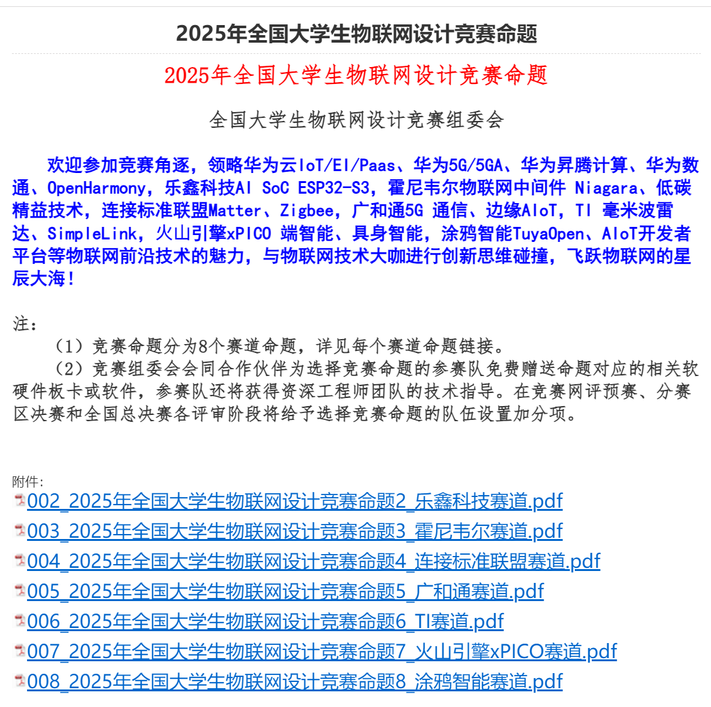

# 前言

总而言之，这是一篇参赛指南，至于写多少，那看我下面发挥

# 比赛类型

此次的比赛类型属于创意赛的一类，基本算是半开放赛题，有指定的硬件或软件，但是也有很多创意或外设之类可以由你们自己发挥，
像是其中的大题目，乐鑫，ti板，华为（海思），广和通这些，基本嵌入式设计这一类比赛都有对应厂家的支持，基本上如果校赛啥的你们都能过的，可以是一个项目参加多个比赛的，可以大幅度降低获奖的时间和精力之类的成本，还是比较鼓励参加的，这种创赛最大的好处就是可以重复参赛，而选择大厂商（华为或乐鑫或TI之类，单指对竞赛的支持力度的话），则是会让你的项目泛用性更广一点，不管他的项目限制是什么，你都可以参加，当然相应的，你的竞争对手也一样会多一些，毕竟除了没经验的（就像当初的我们），哪来这么多愣头青。

# 为什么让你们参加

其实这次比赛算是我让你们半强制参与的，毕竟扪心自问，你们最近是不是有点摆。虽然大学可能并不需要像是我们这一届咱社团的这些学长这么累，因为毕竟我们没有传承，想要比赛，想要获奖，想要提升能力，都需要靠自己，老师是辅助，咱又不是啥好大学，哪有那么多从天上掉下来的机会，现在的比赛都算是我们争取出来的，平时关注各种官网，公众号，厂商发布的信息，自己出想法，做实物，和老师同学们协调，咱院主办还好，他院主办，还要和其他院的协调。这些还都没让你们接触，大三我们就半退休了，考研的考研，实习的实习，你们如果还留的话，这些就只能你们干。
而这次比赛的机会就很好，首先这比赛咱们院主办，校赛好过一点，不会有什么卡脖子的状况出现，其次，就是上面的比赛类型了，创意赛，但是半开放型的，难度也没像上次的服创之类的比较大（上次你们组的队好像都噶了，这也是我写这一篇文章的原因之一吧），华为，TI和乐鑫的那几款板子也相对来说比较常用，资料也还行，性能也还好，单纯做下位机也是够用的，软件类也能让你们除keil外接触一下其他的ide或者其他东西，就像是华为或者火山引擎的物联网平台，技术方面是能得到一定的提升的。再其次这个比赛刚进榜单没多久，竞争少一点，比较容易拿奖（当然实在你们认真做的前提下哈）。另外让你们了解一下一些比赛流程之类和常规要交的东西，和怎么准备，这些是你们早晚要学的，提前接触下。
最后这种半强制肯定是最后一次了（至少我的话），你们不想参加，我还不想指导呢，我有这空干点自己的事不好吗，四级，电赛综测，考研初试，半人型机器人的项目，一数就一堆事，从客观利己的角度来讲，做这些的好处也更多一点，为啥我要顶着你们骂去强制你们参加这些比赛呢，对我有啥好处吗？还真有，我是你们学长和社长，满足我的一些个人感情上的需求，仅此而已。

# 选题

打了这么多，也该讲下正事了，首先是选题

# 我打算怎么给你们准备

